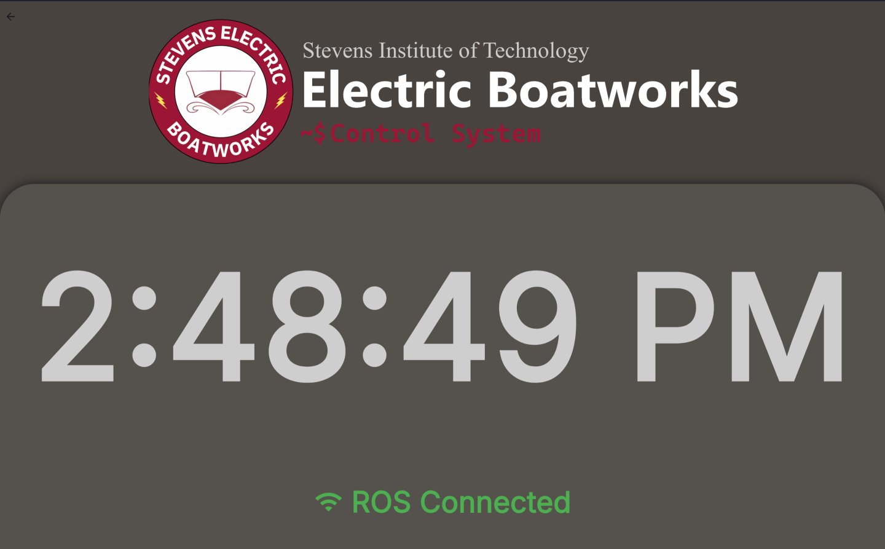
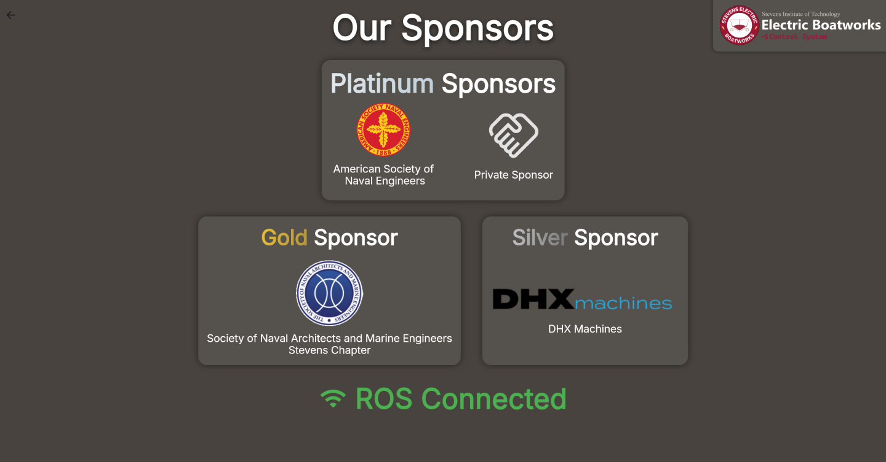

# Feature List

The Tidal Telemetry platform has 3 core projects, **TidalCore**, **TidalShore**, and **TidalView**, which each exist to fill a specific requirement of the control system. This page breaks down all of the features across all of the platforms:

## TidalCore

### Distributed Architecture

TidalCore is built with a distributed archectuire in time. This means that a single failure in one system (such as CAN integration, GPS, etc.), will not propagate to the rest of the control system, and reduces single points of failures. 

This results in TidalCore being very fault-resistant, and removes most software-based full crashes. 

### CAN Bus Integration

TidalCore integrates seamlessly with the Inmotion ACS motor controllers (inverters), battery management system, and cooling sensors which allows for:

* Monitoring of all motor parameters, including voltage, current, torque, RPM, etc.
* Integrates into the fault management system of the motor controllers to see errors internal to the motor controller, and raise them to the operator, without requiring the use of propriety software
* Communicates with the battery management system to monitor cell health, current and voltage draw, pack capacity, etc.
* Integrates into fault management system of the battery management system to interface with other control system components
* Monitors cooling loop temp. with sensors connected via the CAN bus
### Fault Management System

TidalCore has its own fault management system, which integrates closely with TidalShore and TidalView to raise alerts about the control system, allowing it to:

* Monitor all control system components internal to TidalCore, including code errors, initialization faults, CAN bus issues, GPS/USB device failures, etc.
* Allow for multiple types of faults, including sticky faults which cannot be cleared unless rebooted
* Integrates closely with TidalShore to allow operators to observe all faults, understand root causes, and allows for quicker debugging
* Automatically compatible with the battery management system and motor controllers

### Automatic Logging

Using the ROSBag utility, TidalCore can automatically record and log all control system components including but not limited to:

* Motor parameters such as voltage, current, temperature, RPM, etc.
* Faults raised by the Fault Management System
* All system logs generated by TidalCore

### Data Replay and Analysis

TidalCore can replay all telemetry from the boat in real time, allowing for:

* Frame-by-frame analysis of key moments
* Re visualization of old data
* Replay of fault messages and their impacts
* Post-processing of old data for debugging

### Cellular or WiFi Connectivity

TidalCore can receive software updates from either the connected cellular module, or WiFI, allowing for:

* Automatic configuration of cellular hat by TidalCore
* Easy remote management via SSH
* Integration with Tailscale for remote administrators
* Robust connectivity even in conditions challenging for typical connectivity systems
* Backup available to use driver hotspot
* Websocket-based connection to shore system

### Integrated WiFi Hotspot

TidalCore can also create its own hotspot by using an external WiFi dongle. This will also enable the provided DHCP server, allowing devices connected to the network to:

* Communicate directly with TidalCore without needing to use cellular or WiFi hotspot
* Easy to use in the field, just turn it on and anyone can connect (with a password)
* If TidalCore is connected to the internet via WiFi, anyone connected to TidalCore can piggy-back off of TidalCore's internet connection
	* This will not occur if TidalCore is only connected via cellular, to prevent downstream devices from hijacking the cell plan
* Allows for gigabit speed transfers from TidalCore using the Ethernet port

### Test Mode

TidalCore can be enabled into "test mode", which will make it output fake data for testing other portions of the control system without needing real hardware. This can be used to:

* Validate TidalView and TidalShore functionality
* Test automatic logging or playback with data that is indistinguishable from real data
* Streamlined developer experience when developing new features

### GPS Integration

TidalCore has access to the following information from the connected GPS module:

* Track and speed information
* GPS location and longitude
* Compatible with the Foxglove GPS message type for quicker visualization

****
## TidalShore

### Realtime Data Visualization
### Fault Management
### TidalCore Diagnostics

### Redundant Data Logging 

### Data Downloading

### Team and User Management

### Optimization for Shore Operators

### Audible Alert System

### Map View

### PWA & Mobile Support

****

## TidalView

### Realtime Data Pipeline

Data from TidalView reads directly from the different subsystems of the control system, which results in:

 * Instantaneous update rate
 * Decentralized data pipeline which isn't dependent on a single node
 * Low performance impact

Furthermore, you can view the following data:

* Motor A and B parameters, including voltage, speed, RPM, torque, current, enabled state, etc. 
* GPS location, drift, satellites, configuration state, speed and track
* Networking information such as IP, SSID's, etc
* Monitor battery management system current and voltage draw
* Cellular module connectivity to shore, including radio parameters
### Embedded Diagnostics Tools

TidalView's tools exist as the first tool for debugging issues that require lower level control, allowing you to:

* Restart or shut down the host OS
* Reinitialize core system components, including the CAN bus, GPS module, and cellular hat
* Monitor GPS configuration state, including satellites linked, found, and current GPS location and drift
* View current networking configuration, including IP, SSID's, etc.
* Monitor CPU usage, memory capacity, networking, and storage requirements before they become a problem
* Allow terminal access for more complex debugging
### TidalCore Log Viewer

See the control system logs in real time from TidalView, allowing you to see:

* TidalCore system logs from all nodes
* See antagonistic logs from TidalView and ROSBridge
* Filter out unnecessary log messages from ROSBridge
### Multi-input Touch Support

TidalCore supports multiple input types, will full support for:

* Touchscreen
* Mice
* Keyboards

### Multi-platform w/ Mobile Support

TidalView can be deployed as both a native application or a web app, with support for the following platforms:
* Linux and Windows
* Headless Linux with FlutterPi
* IPad, Phones, etc.
* Any device which can run a web browser with a big screen
### Layout Locking

Prevent water from accidentally shutting down TidalCore by using layout locking, requiring swipe to unlock the screen.

### Standby Mode

TidalView's standby mode allows for a "screensaver" to be displayed on the touchscreen, including a thank you for our sponsors.