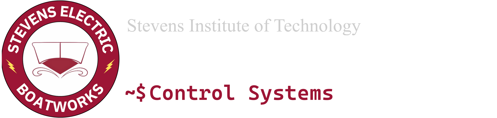

# Tidal Telemetery

([Website](https://stevenseboat.org/) | [Support Us ❤️](https://stevenseboat.org/support-us) | [Instagram](https://www.instagram.com/stevenseboat/) | [LinkedIn](https://www.linkedin.com/company/stevenseboat/) | [Join Us!](https://ducklink.stevens.edu/sname/home/))
## About Us

Stevens Electric Boatworks is a student-led engineering team dedicated to advancing sustainable marine technology. Each year, we design, construct, and test two vessels: a manned electric boat and an unmanned autonomous electric boat.

Our team competes in the American Society of Naval Engineers’ Promoting Electric Propulsion (PEP) competition, which challenges student engineers nationwide to push the boundaries of electric propulsion and autonomous systems. Through this competition, we gain real-world experience in naval architecture, electrical engineering, and systems integration.

Founded with the mission to innovate and inspire, Stevens Electric Boatworks provides students with hands-on opportunities to apply classroom knowledge, collaborate across disciplines, and contribute to the future of clean maritime technology.

## Our Projects

This GitHub repository only contains projects used by the Control Systems Team. For more information on the cooling system, drivetrain, hull, etc., [visit our website!](https://stevenseboat.org)

### [Manned Boat](https://github.com/Stevens-Electric-Boatworks/manned-boat/)  ([`Wiki`](https://github.com/Stevens-Electric-Boatworks/manned-boat/wiki))

The Manned Boat utilizes Robot Operating System 2 (ROS2) to be able to provide advanced data monitoring, logging, and replay tools using both ROS tools and custom tooling. It also features a custom faults system, including latching/sticky faults, all sent to the shore system via a WebSocket connection.
### [Shore Client](https://github.com/Stevens-Electric-Boatworks/shore-client)

**Try it [on the web!](https://shore.stevenseboat.org)**

The shore client/website allows team members to monitor boat parameters, including motor specifications, GPS location, and coolant temperatures. Furthermore, it allows us to remotely monitor diagnostic features of the boat, including ROS logs, node and CAN bus status, as well as manage boat faults.

### [Waterboard Driver Dashboard](https://github.com/Stevens-Electric-Boatworks/waterboard)

**Try the [experimental web version](https://stevens-electric-boatworks.github.io/waterboard/)!**

**Waterboard** is the custom-built driver dashboard deployed on the **Manned Boat**, developed using Flutter. The main goal of this Dashboard is to be the primary source of information for the Driver, and everything, from the color scheme, to the layout of components is optimized for high readability. It is also a debugging and control panel for the Control System Team, providing tools to help debug connection issues from both Waterboard and ROS.

### [Shore Server](https://github.com/Stevens-Electric-Boatworks/shore-server)

The shore server performs shore-side data logging, as well as being the connection point for all boat. Data from the server is propagated to clients via a WebSocket.

### [ROSBag to CSV](https://github.com/Stevens-Electric-Boatworks/rosbag-to-csv)

This GUI utility allows a user to convert a ROS Bag file from the boat into a CSV file for further analysis, **WITHOUT** needing to have a sourced ROS2 workspace, or even the code. By utilizing a custom `.rosdef` file generated by the software in a proper ROS2 workspace, it can be shared with those who wish to analyze log files from the boat outside the control system team.

## Contact

**Stevens Electric Boatworks**: [stevenseboat@gmail.com](mailto:stevenseboat@gmail.com)

###Maintainers

**Ishaan Sayal**: [isayal@stevens.edu](mailto:isayal@stevens.edu)

**Thiago Andrade**: [tandrade1@stevens.edu](mailto:tandrade1@stevens.edu)