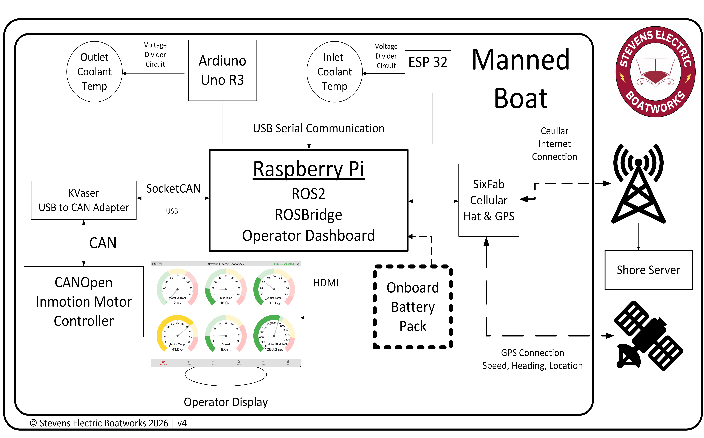
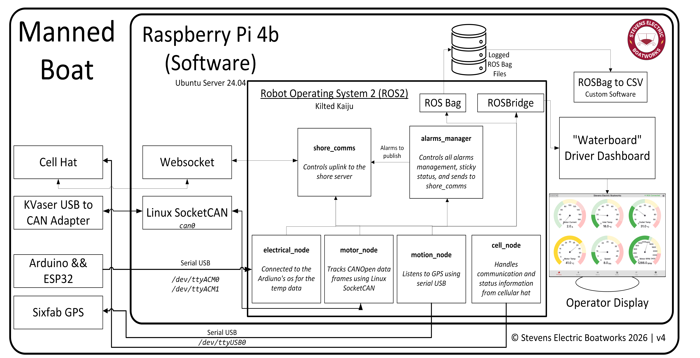

## Overall System

{ width=60%"}

There are 5 primary components to the system:

* TidalCore/Raspberry Pi/Controls PC
	* This runs the primary controls software, reads sensor data, and communicates with the shore
* Shore System
	* This is our remote monitoring platform, which we communicate with using a cellular internet connection
	* Can be used to see boat logs, faults, configuration settings, and all parameters
* GPS/Cellular Connection
	* Using a USB serial connection, the SixFab Cellular Hat & GPS provides us with speed, track, and an internet connection
* Inmotion CANOpen Motor Controller
	* CANOpen is the protocol which allows us to communicate with the motor controller
	* We use a USB to CAN adapter from Kvaser which allows us to 
* Cooling Temperature Sensors
	* **NEW: These sensors are now connected to the CAN bus instead, and do NOT use a USB serial communication**
* TidalView Driver & Tech Display
	* Primary interface for the driver during the race and used for on-field troubleshooting with it's integrated 

All the components on the boat are connected directly TidalCore/Controls PC, and all of this data is communicated to the shore system. 

## TidalCore System Diagram
{ width=60%"}

TidalCore is the primary software running on the Manned Boat. Its distributed architecture means that all the major systems are split into their own individual program, which can then communicate with each other. 

The main nodes are:

* **shore_comms** - Handles communication to the shore system by using a websocket with a custom JSON protocol
* **alarms_manager** - Manages all the faults on the boat by referencing an internal database, and sends it to the shore system
* **motor_node** - Communicates to the CAN subsystem, including the motor controller and cooling sensors
* **motion_node** - Talks to the GPS hat by using serial USB
* **cell_node** - Configures the cellular module and parses connection statistics

In order to record data from all the nodes, we use ROS Bag, a program which collects all the data passing between the nodes and logs them. These logs can then be later replayed, converted into a .csv, or analyzed with Foxglove.

We also have TidalView, the driver dashboard deployed on the boat. In order to parse the data in ROS, we use ROSBridge, a program which converts the ROS data into JSON which can be parsed by TidalView. 

Finally, we also have the CAN subsystem. We use a USB-to-CAN device from Kvaser, which allows us to use Linux's SocketCAN implementation. SocketCAN allows us to treat the CAN bus as a normal network interface, greatly simplifying the implementation of CAN in software.

