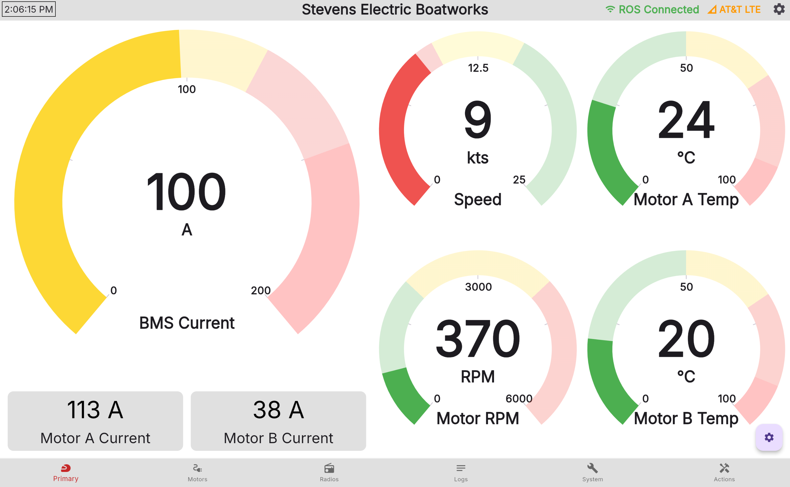

**TidalView** is the custom driver and technician dashboard that runs directly on the Controls PC, providing real time data, debugging information, logs, and more on a bright, touchscreen display.

## Project Goals

TidalView has 2 goals, to be an easy to parse driver dashboard, and a technical debugging interface. This drives many of the decisions taken with TidalView, and separates it from TidalShore for this reason. 

Many of the components that will be made for TidalCore should be made assuming that the driver will have extremely limited vision. Due to the nature of a race boat, there will be heavy vibrations, so small text will not be visible. Gauges, dials, and similar components are therefore recommended in order to allow the driver to easily parse information.

However, in the event that the boat has some kind of controls issue, TidalView must also be able help debug, especially in situations where TidalCore cannot connect to the shore system. Therefore, having controls for checking system logs, rebooting core system, configuring TidalCore or the OS, and real-time data is critical. 

## Ingesting Data

TidalView ingests data directly from ROS2 using ROSBridge. Unlike the shore system where ROS2 data first passes through a `shore_comms` node which converts into our own protocol to communicate with the shore, TidalView reads basically raw ROS2 messages. 

However, since Dart (which is the language that Flutter uses) does not support ROS, we need to instead use ROSBridge. ROSBridge works by converting raw ROS messages into a JSON stream, which we can use by listening to the WebSocket. 

## MVVM Architecture

TidalView uses a Model-View-ViewModel architecture, which is a software design pattern that separates user interface (UI) from the logic of the application. 

In the case of TidalView, this means that all visual components (dials, text boxes, maps, etc.), are not directly reading data from the ROSBridge stream. Instead, it reads an intermediate structure, which provides the data in an agonistic way. Instead, the model is responsible for handling data to the software backend, parsing ROS data, and converting it into a form which is suitable for the specific view component. 

By doing this, it makes it very easy to test the different components of the software. We can inject a fake model in order to unit test visual components, or inject fake ROS data to unit test the data parsing pipeline. 

