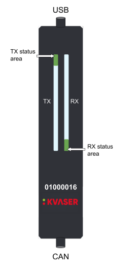
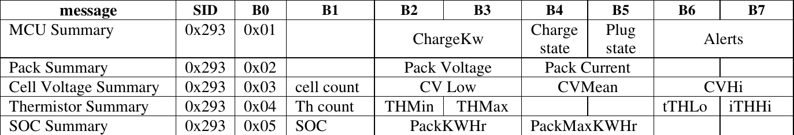

TidalCore uses a [CAN Bus](https://www.csselectronics.com/pages/can-bus-simple-intro-tutorial) to be able to communicate with several control system components, which are the motor controllers, battery management system, and temperature sensors connected to the cooling loop. 

There are a few different components which allow us to use the CAN Bus:

* The [Kvaser USB to CAN Adapter](https://kvaser.com/product/kvaser-u100/)
* Linux [SocketCAN](https://docs.kernel.org/networking/can.html)
* `can_node`

The following devices are connected to the CAN Bus:

* 2 Inmotion ACS Inverters (Motor Controllers)
	* These are the only devices which communicate using [CANOpen](https://www.csselectronics.com/pages/canopen-tutorial-simple-intro)
* Battery Management System
* Cooling Temperature Sensor

## Linux CAN Configuration

Linux already has support for CAN built into the kernel, which means that all we have to do is enable the CAN implementation for the specific USB device. When we plug in the Kvaser can adapter into the Controls PC, we want it to automatically enable and be brought up. 

To do this, we will create a `udev` rule by creating and opening a file at `/etc/udev/rules.d/80-can.rules`:

```shell
sudo touch /etc/udev/rules.d/80-can.rules
sudo vim /etc/udev/rules.d/80-can.rules
```

We will then put inside of the file:
```
SUBSYSTEM=="net", ACTION=="add", KERNEL=="can*", TAG+="systemd", RUN+="/bin/systemd-run --no-block /usr/local/bin/setup-can.sh %k"
```

This will run a script whenever a CAN adapter is detected by the kernel. We will now create a script for this at `/usr/local/bin/setup-can.sh`:

```bash
#!/bin/bash
IFACE="$1"
sleep 1
ip link set "$IFACE" down
ip link set "$IFACE" up type can bitrate 500000
```

This configures the CAN bus to run at a bitrate of 500 kbps.

## Kvaser Adapter



The Kvaser adapter also has a set of LED's on the front which shows the configuration state. A reference table is provided:

### Kvaser LED Reference Table


| Description                    | Status Area        | LED Bar            | Notes                                                                                                       |
| ------------------------------ | ------------------ | ------------------ | ----------------------------------------------------------------------------------------------------------- |
| Power is on                    | On (White)         |                    |                                                                                                             |
| Waiting for USB Configuration  | Fast blink (Blue)  |                    | *If stuck on this step, that means that the `udev` rule configuration was unsuccessful. Check `dmesg` logs* |
| CAN Channel On                 | On (Green)         |                    | *Successful USB device configuration, but no traffic*                                                       |
| CAN Channel Traffic            | On (Yellow)        | Dynamic (Yellow)   | *The length of the LED will scale depending on bus traffic and usage*                                       |
| Error Frame                    |                    | Dynamic (Red)      |                                                                                                             |
| CAN Channel is Error (Passive) | Fast Blink (Red)   |                    |                                                                                                             |
| CAN Overrrun                   | On (Red)           |                    |                                                                                                             |
| Firmware Update                | Slow Blink (Blue)  |                    |                                                                                                             |
| Locate Hardware                | Slow Blink (White) | Slow Blink (White) | *This can only be triggered using Kvaser's CAN library, which we do not use*                                |

## Inmotion CAN Protocol

!!! info
	We are still working on understanding the CAN protocol for the Inmotion motor controllers. Certain features, such as PDOs, are not included here.

Communication with the Inmotion motor controllers happens using CANOpen, a protocol built on top of CAN which allows for much more advanced communication between two devices. 

The primary way to get data from the motor controller is to use a **Service Data Object (SDO)**. To get data from the motor, we send an SDO with an **index** and **sub-index**. To figure which ones we need, we took at an object dictionary file, which describes all of the data we can get via an SDO, and the specific indexes needed to retrieve them.

We will use the syntax `index:subindex` to represent an SDO read. For example, index `0x1002` sub-index `3` will be called `0x1002:3`.

!!! example
	If we want to get the voltage, we would go into the object dictionary file and find that it is located at index `0x2030`, at sub-index `2` with a factor of `0.01` (meaning we need to do `value * 0.01` to get the real number). You can find these indexes in the object dictionary reference below.

We perform these actions multiple times per second using the python `canopen` library, which provides API access to request SDO's.

!!! tip
	It is highly recommended to read more into the CANOpen standard, specifically about how SDO's are communicated, PDO's, and the overall node structure of a CAN bus. We mix both CAN and CANOpen on the same bus.

### Motor Controller Fault Reading
In order to read faults from the motor controller, we need to perform multiple SDO requests, and then compare it to a table provided in the object dictionary (which we have replicated in our own `faults.csv` file in the TidalCore code repo).

In order to get the faults, we first send an SDO read request at `0x3011:0`. This will trigger the controller to update the list of active events. We will then read `0x3011:1`, which will return an array of event-ids. These event-id's are correlated to a list of emergency error codes, which we can search up in the provided object dictionary reference (provided below)

Each event-id is unique, but it is paired with an emergency code, which is not unique (not sure why), which we we include in our `faults.csv` database which is a part of the TidalCore code repo. 

### Inmotion Object Dictionary Reference
<iframe src="../../assets/docs/inmotion-object-dictionary.html" width="150%" height="800px" style="border:none;"></iframe>


## Battery Management System

The battery management system (BMS) does **not** use CANOpen. Instead, CAN messages are split into different sections, and depending on what kind of header it is, we interpret the rest of the sections differently. 

We will receive 8 bytes from the battery management system. Then, depending on the value of byte 0 (`B0`), it will tell us what kind of data it is, and how to interpret the rest of the data.


///caption
A handy table which will show you how to interpret the results.
///

For example, if the first byte in the byte array is `0x02`, then we know that index 2 and 3 combined will give us the pack voltage. We can then get the integer value with the following code:
```python
pack_voltage_raw = int.from_bytes(data[2:4], 'little', signed=False) / 10.0 
# Divide by 10 since only integers can be sent, so we have to perform the conversion ourselves
```

All numbers transmitted are little-endian. 

However, the BMS does not send the data by itself. We have to prompt it to send the data. We can do this by transmitting a CAN message with an ID of `0x313` with the data `[0x01, 0x01, 0x01, 0x01, 0x01, 0x01, 0x01, 0x01]`. Each index represents a kind of a data that we want transmitted, and since we want everything, we use `0x01` on everything.

### BMS User Guide

<object data="../../assets/docs/bms_user_guide.pdf" type="application/pdf" width="75%" height="900px"> <p>Your browser does not support PDFs. <a href="../../assets/docs/bms_user_guide.pdf">Download the BMS User Guide PDF instead</a>. </p> </object>

## CAN Cooling Temperature Sensors

The cooling temp sensors are custom PCB's which have a thermistor attached to them, which transmit their detected temperature over the CAN bus. 

Each CAN message sent is send with a CAN arbitration ID of `0xbe` and can be decoded by doing the following:

```python
temp = int.from_bytes(data[0:2], 'little', signed=True) / 100
```

