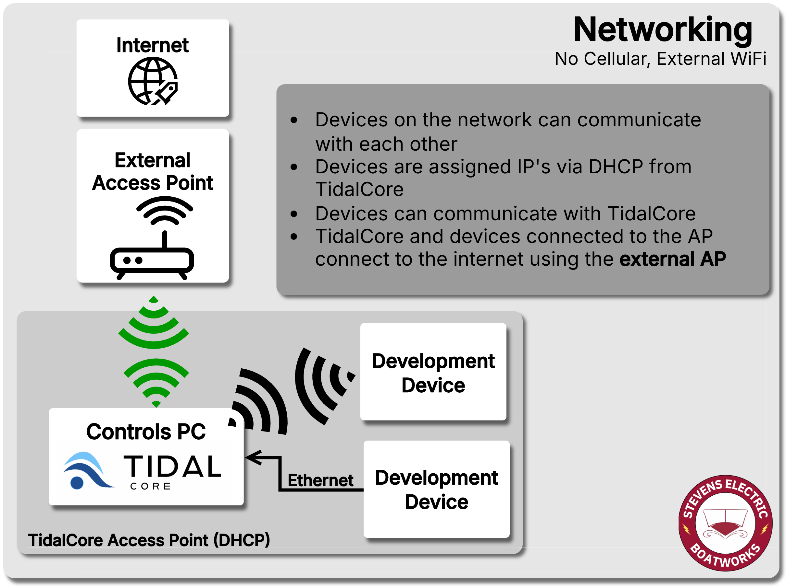
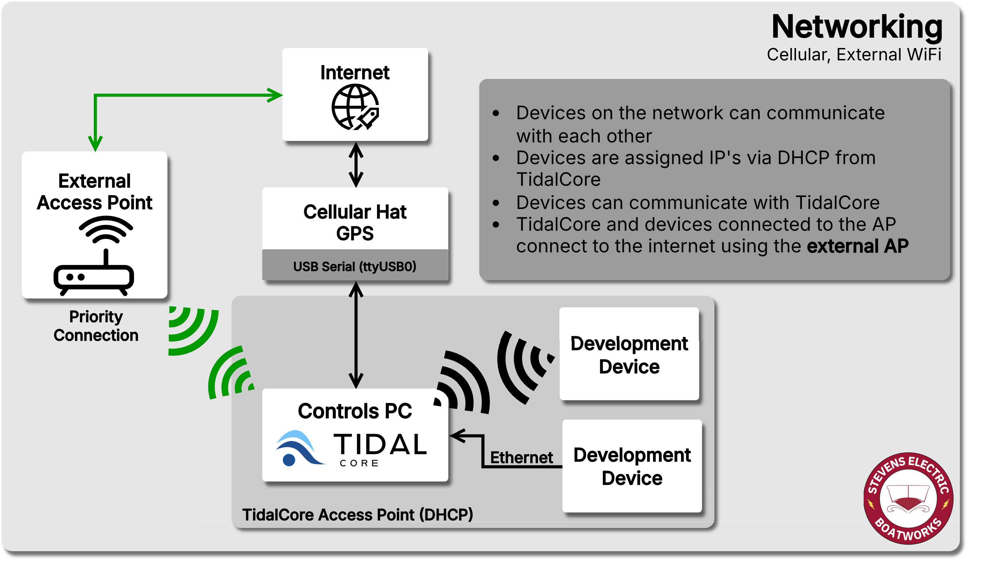
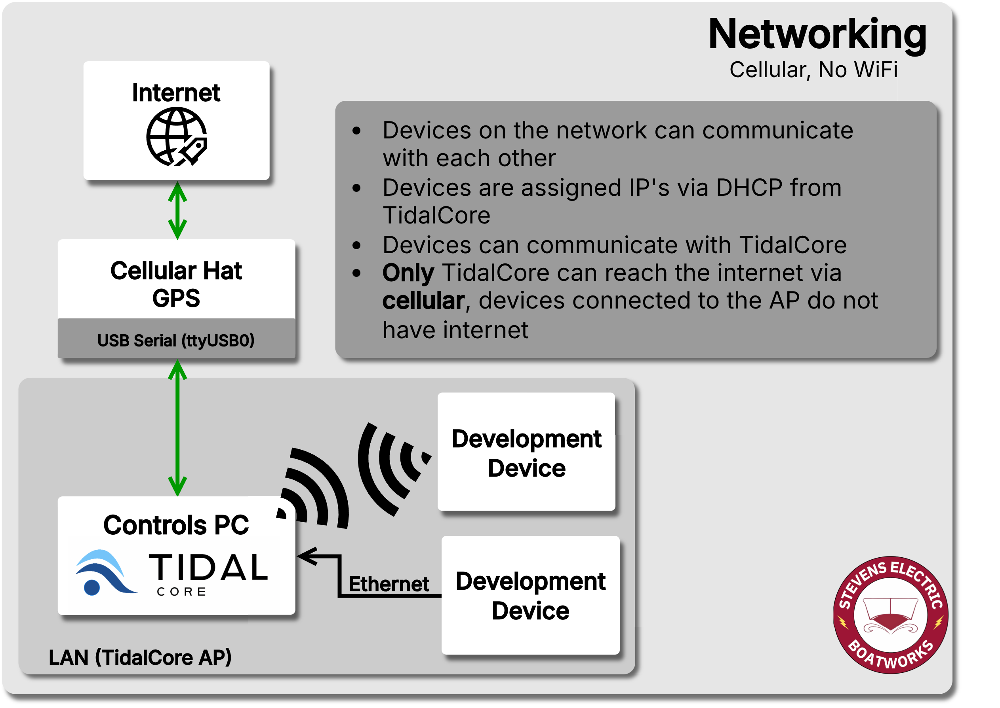
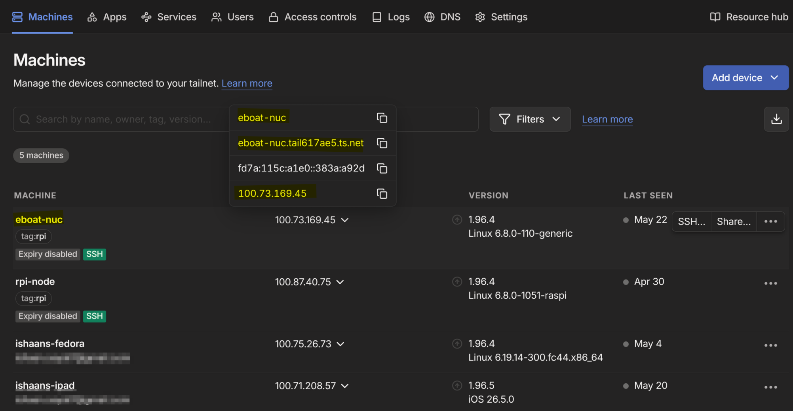

## Cellular

The Controls PC uses a [SixFab LTE Cellular Hat and GPS module](https://sixfab.com/product/raspberry-pi-4g-lte-modem-kit/), which connects over USB to provide both an internet connection and GPS positioning. 

The cell hat will appear on the following `tty` ports:

| `tty` port     | Purpose                                                                                                      |
| -------------- | ------------------------------------------------------------------------------------------------------------ |
| `/dev/ttyUSB0` | Network Connection                                                                                           |
| `/dev/ttyUSB1` | GPS [NMEA Strings](https://receiverhelp.trimble.com/alloy-gnss/en-us/NMEA-0183messages_MessageOverview.html) |
| `/dev/ttyUSB2` | Module Configuration (Cell && GPS)                                                                           |

You can use `minicom` to talk to the cell hat, and use the AT commands to configure it. The `cell_node`, `motion_node` and `boat_common_libs` contain the code which directly interface with these USB devices and configure/read from them.

The documentation needed to configure the cell hat using libqmi can be found [here](https://docs.sixfab.com/page/setting-up-a-data-connection-over-qmi-interface-using-libqmi).

## Built-in Access Point (AP)

TidalCore features a built-in wireless access point that authorized devices can connect to. It serves as a simpler networking solution to easily access TidalCore, and is only authorized for certain members.

TidalCore is automatically configured as a DHCP server, which means that devices can be connected directly to the Controls PC (development laptops, extra computers, etc), and will be given IP's and can communicate with one another. This will also apply if you connect to the TidalCore hotspot. 

Furthermore, devices connected to TidalCore can use it's internet connection if it is connected to WiFi to also connect to the internet.

### AP/DHCP Configuration

The built-in access point is configured using [RaspAP](https://raspap.com/), which is configured as the following:

#### Access Point
These are the basic configuration settings for the access point.

| Setting             | Value                | Note                             |
| ------------------- | -------------------- | -------------------------------- |
| SSID                | `Stevens-EBoat`      |                                  |
| Password            | ----------           | *Ask controls member for access* |
| Wireless Channel    | `7`                  |                                  |
| Wireless Mode       | `802.11n - 2.4/5ghz` |                                  |
| Admin Account Login | ----------           | *Ask Ishaan for access*          |

#### Wireless `wlan0` 
This is the configuration for the wireless interface that broadcasts the access point.

| Setting                       | Value                        | Note                                                                                               |
| ----------------------------- | ---------------------------- | -------------------------------------------------------------------------------------------------- |
| Gateway (TidalCore) Static IP | `10.3.141.1`                 | *This is the IP that TidalCore/Controls PC will have on the network, as well as being the gateway* |
| Subnet Mask                   | `255.255.255.0`              |                                                                                                    |
| Client DHCP Range             | `10.3.141.50 - 10.3.141-254` | *These are the IP's that devices connected to the wireless access point are given*                 |
| Lease Time                    | `12h`                        | *Certain devices, like key development laptops and TidalCore have static IPs*                      |

#### Wired `eth0`
This is the configuration which is used when a device is directly connected to the Ethernet port of the PC. This may either be direct, or though an unmanaged switch.

| Setting           | Value                           | Note                                                                  |
| ----------------- | ------------------------------- | --------------------------------------------------------------------- |
| Gateway Static IP | `1292.168.55.1`                 |                                                                       |
| Subnet Mask       | `255.255.255.0`                 |                                                                       |
| Client DHCP Range | `192.168.55.5 - 192.168.55.150` | *These are the IP's that devices connected to the Ethernet are given* |
| Lease Time        | `10h`                           |                                                                       |

### No Cellular with WiFi

In this configuration, all devices on the Tidal network can communicate with themselves and the internet with no restrictions.

### Cellular with WiFi

In this configuration, both TidalCore and downstream development devices will connect to the internet using the WiFi connection, and the cellular connection will remain unused. However, TidalCore can still communicate to the devices cellular module over serial USB for typical monitoring tasks. 

### Cellular w/o WiFi

In this configuration, TidalCore is able to communicate with the internet normally using the cellular hat, **but** the downstream devices **cannot** communicate with the internet using the cellular hat. This is so development laptops cannot hijack the cellular plan and accidentally drain the available data plan. 

## VPN 

///caption
The tailscale dashboard, where you can see all connected devices in the network, as well as find the provided IP's and DNS names.
///

The Controls PC is connected to our VPN which is run by **Tailscale**. You can use Tailscale to remotely access TidalCore without needing to be directly connected to it. By default, TidalCore is configured to join the Tailscale on startup.

This allows for admins to be able to connect to the boat on a remote device running TidalView, allowing for the same view that the drivers have. 

!!! warning
	Be careful when performing software updates whilst connected using Tailscale. You want to make sure that Controls PC is connected to the internet using a WiFi connection, not cellular!